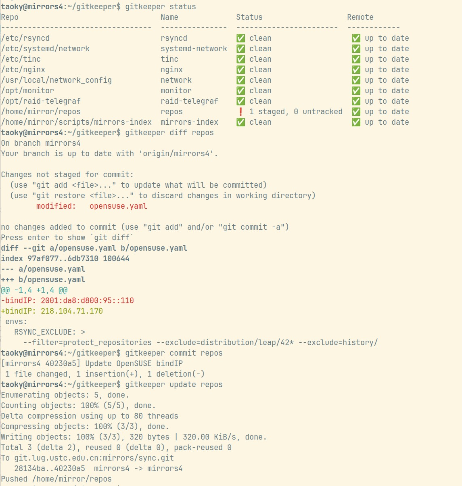

# git-keeper

Works like etckeeper, but tracks git repos specified instead of just `/etc`.

No third-party dependencies required. Python >= 3.9 (as the one for Debian 11). It's expected for this script to run in supported Ubuntu LTS and Debian (5 years, ESM and ELTS excluded).

As `gitkeeper` conflicts with `mrb`, it's renamed to `git-keeper` now.

Available in [GitHub](https://github.com/taoky/git-keeper) and [Debian GitLab (Salsa)](https://salsa.debian.org/taoky/git-keeper).

## Install

### Debian install

You could download the `.deb` file from [Releases](https://github.com/taoky/git-keeper/releases/tag/rolling) page. And then install it with `apt` -- it has very minimal dependencies so it should install smoothly.

Note that it's recommended to remove `/usr/local/bin/gitkeeper` or `/usr/local/bin/git-keeper` if you have installed it manually before.

### Single file install

```shell
sudo wget https://github.com/taoky/git-keeper/raw/master/git-keeper -O /usr/local/bin/git-keeper
sudo chmod +x /usr/local/bin/git-keeper
sudo ln -s /usr/local/bin/git-keeper /usr/local/bin/git-kp
```

And then create `/etc/git-keeper.conf` with repos you need to track.

If you're using bash, you could download the completion script:

```shell
sudo wget https://github.com/taoky/git-keeper/raw/master/completions/git-keeper.completion.bash -O /etc/bash_completion.d/git-keeper
```

If you want to add motd, add following files:

```shell
sudo wget https://github.com/taoky/git-keeper/raw/master/motd/99-git-keeper -O /etc/update-motd.d/99-git-keeper
sudo chmod +x /etc/update-motd.d/99-git-keeper
sudo wget https://github.com/taoky/git-keeper/raw/master/motd/git-keeper-motd.service -O /etc/systemd/system/git-keeper-motd.service
sudo wget https://github.com/taoky/git-keeper/raw/master/motd/git-keeper-motd.timer -O /etc/systemd/system/git-keeper-motd.timer
sudo mkdir -p /etc/git-keeper.d
sudo wget https://github.com/taoky/git-keeper/raw/master/motd/motd-clean.tmpl -O /etc/git-keeper.d/motd-clean.tmpl
sudo wget https://github.com/taoky/git-keeper/raw/master/motd/motd-dirty.tmpl -O /etc/git-keeper.d/motd-dirty.tmpl
sudo systemctl enable --now git-keeper-motd.timer
```

## Help

```console
$ git-keeper help
usage: Track git repos [-h] [--config CONFIG] [--parallel PARALLEL] {status,commit,update,vcs,ls,diff,help} ...

positional arguments:
  {status,commit,update,vcs,ls,diff,help}
    status              Show status of repo(s)
    commit              Add all and commit changes in repo(s) on behalf of current user
    update              Push/pull repo(s) with remote
    vcs                 Run a git command on repo(s)
    ls                  Just list all repos
    diff                Show changes in given repo
    help                Show help

options:
  -h, --help            show this help message and exit
  --config CONFIG, -c CONFIG
                        Path to config file
  --parallel PARALLEL, -p PARALLEL
                        Threads to use for status and update commands
```

`PARALLEL` defaults to 8.

A special name, `.`, could be used to represent the current directory repo if it exists in config file. This means that you could set `alias gitkp="git-keeper vcs ."` and enjoy `gitkp` same as how you use `git` before. Also, you could put a symlink named `gitkp` to `/usr/local/bin` pointing to `git-keeper`, and then use `gitkp` directly.

## Example



## Finding all git repos

```bash
sudo find / -name .git -type d -xdev 2>/dev/null
```

## Config example

### `/etc/git-keeper.conf`

```ini
[.config]
# .config is a special case that used to configure git-keeper itself
motd-template-dirty = /etc/git-keeper.d/motd-dirty.tmpl
motd-template-clean = /etc/git-keeper.d/motd-clean.tmpl

[rsyncd]
path = /etc/rsyncd

[systemd-network]
path = /etc/systemd/network

[repos]
path = /home/mirror/repos
user = mirror
```

By default git-keeper would try to get the owner of specified folder and use it as the user to run git. You can specify a user in the config file to override this.

### `~/.git-keeper.conf`

```ini
[user]
email = me@example.com
name = example
```

git-keeper would ask your email if the file does not exist, and use username as name. You could override them in the config file. If `~/.git-keeper.conf` does not exist, git-keeper would try reading `~/.gitconfig` to see if `user.email` is set, and use it and `user.name` (or username).

Note that if you use `sudo` to run git-keeper, it would still use the config file in the home directory of the user (instead of root) who runs it.

## Practice of SSH deploy key

git-keeper would not try to push repositories when it has a HTTP(S) remote (as you need to type in password/code in most cases). So you might what to use SSH deploy key.

However, GitHub does not support to use a same deploy key for multiple repositories. In this case you can create a deploy key for each repository:

1. Create a SSH key pair inside the `.git` directory of the repository.

    ```bash
    cd .git
    # RSA key pair
    ssh-keygen -f ./id_rsa -t rsa -b 4096 -N ""
    # or ED25519 key pair
    ssh-keygen -f ./id_ed25519 -t ed25519 -N ""
    ```

2. Update `.git/config` like this:

    ```ini
    [core]
        # ...
        # RSA key pair
        sshCommand = ssh -i .git/id_rsa
        # or ED25519 key pair
        sshCommand = ssh -i .git/id_ed25519
    ```

3. Add public key (`id_rsa.pub` or `id_ed25519.pub`) to the repository's deploy keys.
